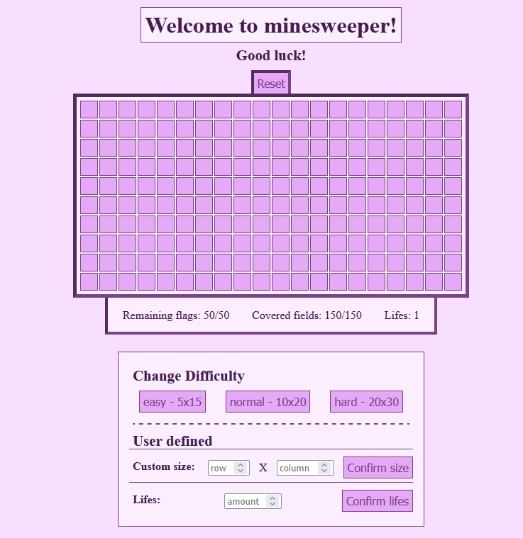
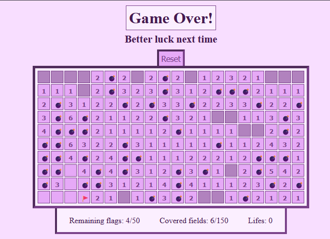
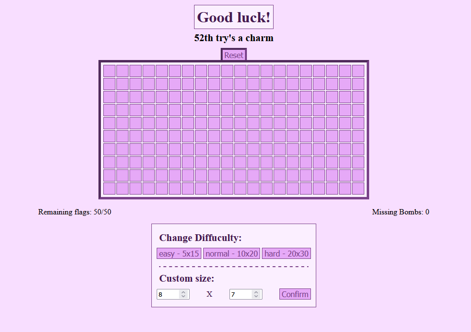
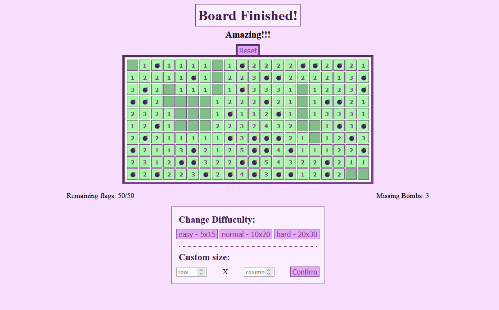

# Minesweeper

Mein HTML Projekt, welches das Spiel Minesweeper darstellt. Beinhaltet die Standard Funktionen von Minesweeper zusätzliche. 
[Tutorial zu Minesweeper.](https://www.youtube.com/watch?v=9Qh6fUlhUrs&ab_channel=TSSSwag)

---
# Screenshots

## Startbildschirm des Spiel, startet immer mit der "Normalen" Schwierigkeit.


## Game Over


## Neustart einer Runde


## Runde gewonnen



---

## 🚀 Funktionen

- Aufdeckung eines Feldes
- Flagge zu ein bedeckten Feld plazieren und entfernen
- Chording 
- Neustart des aktuellen Spielfelds
- Drei voreingestellte Spielfeldgrößen auswählbar
- Benutzerdefinierte Speilfeldgrößen
- Änderung des Unter- und Titel anhand Spielsituation (Gewonnen, Neustart, Verloren)
- Aufzählung von neugestarteten Runden nach einer verlorenden

---

## 🛠️ Technologien

- **Sprachen:** JavaScript
- **Frontend-Technologien:** HTML & CSS
- **Entwicklungsumgebung:** Visual Studio Code

---

## 🔧 Ausführung

### Schritte ohne Installation

1. [Diesen Link aufrufen und eine Spielfeldgröße auswählen, falls es nicht ladet](https://html-preview.github.io/?url=https://github.com/PPahl04/minesweeper/blob/main/index.html)

### Schritte für Installation

1. Repository klonen:
   ```bash
   git clone https://github.com/PPahl04/minesweeper.git
   cd minesweeper

2. Anwendung starten
    ```bash
    index.html
