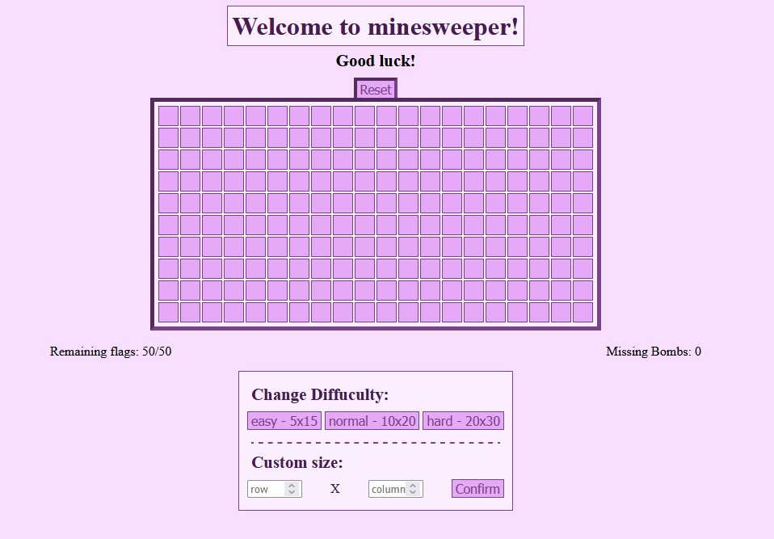
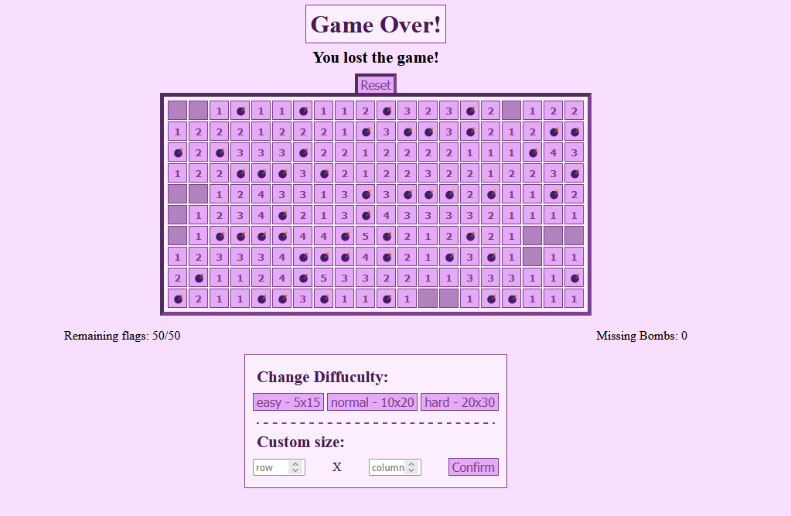

The classic minesweeper game recreated within a little html project with css and javascript.  
[Tutorial to minesweeper.](https://www.youtube.com/watch?v=9Qh6fUlhUrs&ab_channel=TSSSwag)

---
## Screenshots

\
\
\

\
\
\


---
## Functions

- revealing field by a click
- placing and removing a flag on a covered field
- chording
- restarting the current playing field
- three preset field sizes to choose from
- custom field sizes
- subtitle and title change based on the game situation
- counting the number of lost rounds

---
## Playing the game

### Steps without installation

1. [Click this link and select a field size if it does not load.](https://html-preview.github.io/?url=https://github.com/Pancham674/minesweeper/blob/main/index.html)

### Steps with installation

1. Clone repo:
   ```bash
   git clone https://github.com/Pancham674/minesweeper.git
   cd minesweeper

2. Run html
    ```bash
    index.html
